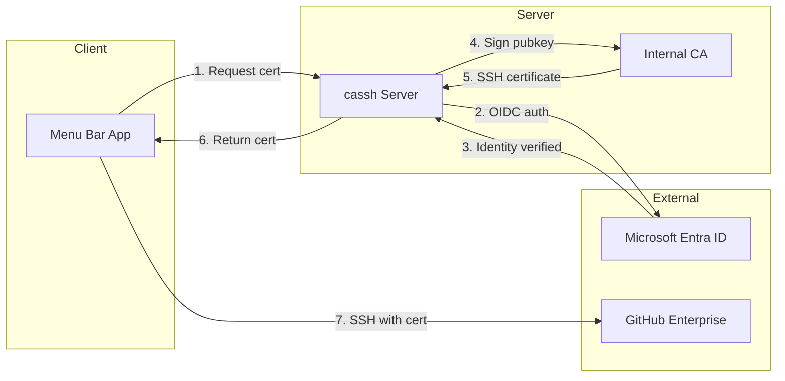
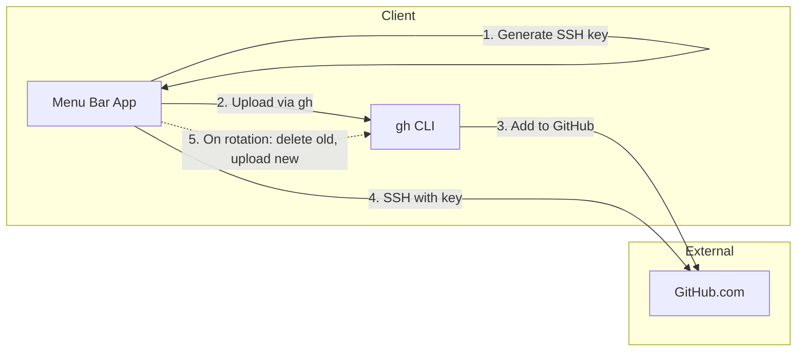

<div align="center">
  <h1>cassh</h1>

  <picture>
    
  </picture>

  <p><strong>SSH Key & Certificate Manager for GitHub</strong></p>
  <p><em>For individuals and enterprises alike</em></p>

  <p>
    Whether you're a solo developer managing personal projects or an enterprise team with hundreds of engineers,<br />
    <code>cassh</code> brings security best practices to your SSH workflow — without the complexity.
  </p>

  <p>
    <a href="https://github.com/shawntz/cassh/releases"></a>
    <a href="https://github.com/shawntz/cassh/blob/main/LICENSE"></a>
    <a href="https://shawnschwartz.com/cassh"></a>
  </p>
</div>

---

## Get Started in 60 Seconds

**Personal GitHub.com users** — no server required:

```bash
# 1. Install GitHub CLI (if you haven't)
brew install gh
gh auth login

# 2. Install cassh
brew tap shawntz/cassh
brew install --cask cassh

# 3. Launch cassh — setup wizard opens automatically — done!
```

**Enterprise users** — see [Server Setup](https://shawnschwartz.com/cassh/server-setup/) for CA and Entra configuration.

---

## Why cassh?

### For Individual Developers

You might think: *"I already use `gh` to upload my SSH key — why do I need this?"*

The `gh` CLI is great for the initial setup, but it doesn't manage your keys:

| The Problem | Without cassh | With cassh |
|-------------|---------------|------------|
| **Key lifecycle** | Keys live forever until you manually delete them | Automatic rotation (4 hours to 90 days) |
| **Laptop lost/stolen** | Your key still works until you notice and revoke it | Key auto-expires per your policy |
| **Shared/work computer** | That SSH key might still be there months later | Set short rotation for shared environments |
| **Multiple machines** | Different keys everywhere, no central management | Same workflow on every Mac |
| **SSH config** | Manually edit `~/.ssh/config` for each account | Automatic configuration |

> **Security isn't just for enterprises.** Your personal GitHub account has access to your private repos, your contributions to other projects, and possibly deploy keys. Treat it accordingly.


### For Enterprise Teams

Permanent SSH keys are a security liability:

| Scenario | With Permanent Keys | With cassh |
|----------|---------------------|------------|
| **Laptop lost** | Manual revocation required, often missed | Certificate expires automatically |
| **Employee offboarding** | Hunt down and revoke all their keys | Certificates expire within hours |
| **Compliance audit** | "When was this key last rotated?" | Full lifecycle tracking |
| **Key compromise** | Blast radius until detected | Limited to certificate validity window |

cassh issues **12-hour certificates** signed by your internal CA. No revocation lists to manage, no keys to track, no manual intervention needed.

---

## One App, All Your GitHub Accounts

Most developers juggle multiple GitHub accounts — work and personal, or multiple organizations. cassh manages them all from a single menu bar app.

- **Enterprise connections** use certificates that auto-expire
- **Personal connections** use keys with configurable rotation
- **Each connection** gets its own SSH key and config entry
- **Status at a glance** — green means you're good, yellow means expiring soon, red means action needed

---

## Features

| Feature | Personal | Enterprise |
|---------|:--------:|:----------:|
| One-click setup wizard | ✓ | ✓ |
| Automatic SSH config | ✓ | ✓ |
| Menu bar status indicator | ✓ | ✓ |
| Key/cert rotation | ✓ (configurable) | ✓ (12h default) |
| Multi-account support | ✓ | ✓ |
| Revoke & renew from menu bar | ✓ | ✓ |
| Microsoft Entra SSO | — | ✓ |
| CA-signed certificates | — | ✓ |
| MDM deployment (PKG) | — | ✓ |

---

## How It Works

### Personal Flow (GitHub.com)

```
Download cassh → Launch → Setup Wizard → Enter GitHub username → Done
```

Behind the scenes:
1. cassh generates an Ed25519 SSH key
2. Uploads it to GitHub via `gh ssh-key add`
3. Configures `~/.ssh/config` automatically
4. Tracks key age and rotates per your policy
5. On rotation: deletes old key from GitHub, generates new key, uploads new key

### Enterprise Flow (GitHub Enterprise)

```
Click menu bar → Generate Certificate → SSO login → Certificate installed
```

Behind the scenes:
1. Opens browser to your cassh server
2. Authenticates via Microsoft Entra ID
3. Server signs your public key with the CA
4. Certificate returned and installed automatically
5. Certificate expires in 12 hours — repeat as needed

---

## Quick Start

### Personal Users

1. **Install prerequisites:**
   ```bash
   brew install gh
   gh auth login
   ```

2. **Install cassh** via Homebrew:
   ```bash
   brew tap shawntz/cassh
   brew install --cask cassh
   ```

3. **Launch** — the setup wizard opens automatically

4. **Add Personal Account** — enter your GitHub username, choose rotation policy

5. **Done!** — `git clone` your repos and go

### Enterprise Users

See the **[Full Documentation](https://shawnschwartz.com/cassh)** for:
- [Server Setup](https://shawnschwartz.com/cassh/server-setup/) — CA keys, Entra app configuration
- [Deployment](https://shawnschwartz.com/cassh/deployment/) — Fly.io, Render, Railway, VPS
- [Client Distribution](https://shawnschwartz.com/cassh/client/) — MDM deployment with PKG

---

## Roadmap

See the [full roadmap](https://shawnschwartz.com/cassh/roadmap/) for details.

| Status | Feature |
|--------|---------|
| :white_check_mark: | GitHub Enterprise SSH certificates |
| :white_check_mark: | GitHub.com personal SSH key management |
| :white_check_mark: | Automatic key rotation with configurable policies |
| :white_check_mark: | Multi-account support (enterprise + personal) |
| :white_check_mark: | Setup wizard for first-run configuration |
| :white_check_mark: | macOS menu bar app with connection status |
| :white_check_mark: | Microsoft Entra ID (Azure AD) SSO |
| :construction: | Policy integrity verification |
| :memo: | GitLab support |
| :memo: | Bitbucket support |
| :memo: | Linux support |

**Legend:** :white_check_mark: Complete | :construction: In Progress | :memo: Planned

---

## Security

> [!CAUTION]
> **For Enterprise deployments:**
> - **Protect your CA private key** — it can sign certificates for anyone
> - **Use HTTPS** — OAuth tokens are transmitted
> - **Restrict Entra app** — limit which users can authenticate
> - Review access logs regularly

> [!TIP]
> **For Personal users:**
> - Use a short rotation policy (4-24h) on shared or work computers
> - Use a longer policy (7-90 days) on personal machines you control
> - cassh stores keys in `~/.ssh/` with proper permissions (0600)

---

## Architecture

### GitHub Enterprise Flow (Certificates)



### GitHub.com Personal Flow (SSH Keys)



---

## Support the Project

`cassh` is built and maintained by [Shawn Schwartz](https://shawnschwartz.com), a PhD candidate in Psychology at Stanford. By day, he builds software for cognitive neuroscience research. By night, he builds security tools like this one.

If `cassh` saved you time or made your workflow more secure:

- [Sponsor on GitHub](https://github.com/sponsors/shawntz)
- Star this repo and share it with others

Every bit of support helps me justify the time spent on this free and open-source side project instead of my dissertation.

---

## Why Open Source?

Security tooling should be auditable. You shouldn't have to trust a black box with your SSH authentication.

Contributions welcome! Check out [CONTRIBUTING.md](CONTRIBUTING.md) to get started.

---

## License

Apache 2.0 — See [LICENSE](LICENSE) for details. © Shawn Schwartz, 2025.
