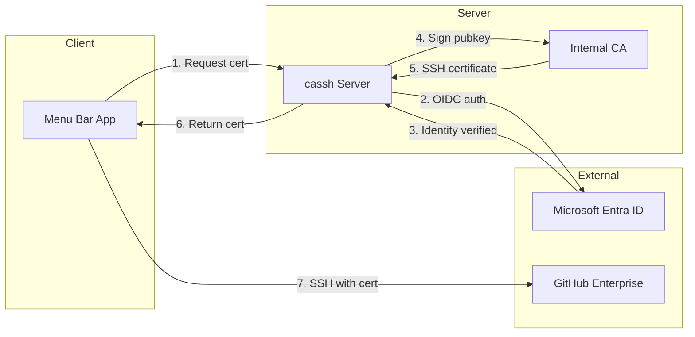

# 💰 `cassh` 💰

### Ephemeral SSH Certificates for GitHub Enterprise

`cassh` is an ephemeral SSH certificate system designed for GitHub Enterprise access.
Developed for [@ghostehq](https://github.com/ghostehq). Inspired by internal tooling [@slackhq](https://github.com/slackhq).

**How it works:**

1. Authenticate with Microsoft Entra (Azure AD)
2. Obtain a short-lived SSH certificate (12 hours)
3. Certificate auto-expires - no revocation needed

## Why cassh?

Permanent SSH keys are a liability. If a laptop is lost, stolen, or compromised:

- **With permanent keys:** Manual revocation required, often missed
- **With cassh:** Certificate expires automatically, zero action needed

## Features

- **Short-lived SSH certificates** - Signed by your internal CA, valid for 12 hours
- **Entra SSO Integration** - Sign in with your Microsoft identity
- **macOS Menu Bar App** - Shows cert status (green = valid, red = expired)
- **CLI for servers/CI** - Headless certificate generation
- **Meme Landing Page** - LSP or Flash Slothmore from the DMV to greet you on login

- **🟢 macOS Menu Bar Status Dot**
  - Green — your cert is valid, go forth and merge.
  - Red — regenerate before you `git push` sadness.

- **🎭 Meme Landing Page Rotation**
  On login, enjoy a random blessing from:
  - **Lumpy Space Princess from Adventure Time**
  - **DMV Sloth from Zootopia**  
  - (They cannot help you, but they will emotionally define you and hopefully leave you with a smile.)

- **💨 Zero Key Rot**
  Every 12 hours, certs evaporate into the void.

## Setup & Installation

### Login Experience (artistically cursed)

- You click "Generate cert"
- Browser opens to cassh portal
- LSP: *"Oh my GLOB just click the button"*
- OR Sloth: *"pl…ease… wai…t…"*

Then boom — new SSH cert, green dot, go commit code.

---

---

## Security

> [!CAUTION]
> `cassh` is a privileged authentication system.
>
> - **Protect your CA private key** - it can sign certificates for anyone
> - **Use HTTPS** - OAuth tokens are transmitted
> - **Restrict Entra app** - limit which users can authenticate
> - Review access logs regularly

---

## Architecture

---

## Support the Project

`cassh` is built and maintained by [Shawn Schwartz](https://shawnschwartz.com), a PhD candidate in Psychology at Stanford where he studies attention and memory using neuroimaging — and teaches courses on research methods, data science, and computer science. By day, he builds software and hardware interfaces for cognitive neuroscience research. By night (and weekends), he tinkers with DevSecOps and builds tools like this one.

I started `cassh` because managing SSH keys across a team is a nightmare, and I kept thinking "there has to be a better way." Then I spent 18 weeks working [@slackhq](https://github.com/slackhq), and there I learned that ephemeral certificates are that better way.

If `cassh` saved you time or made your infrastructure more secure, consider supporting its development:

- [GitHub Sponsors](https://github.com/sponsors/shawntz)
- Star this repo and share it with others

Every bit of support helps me justify the time spent on this free and open-source side project instead of my dissertation.

---

## Why Open Source?

`cassh` is open source because security tooling should be auditable. You shouldn't have to trust a black box with your SSH authentication infrastructure.

I've learned so much from reading other people's code, and I hope `cassh` can be useful to others — whether you're learning `Go`, building your own auth systems, or just curious how SSH certificates work under the hood.

Contributions are welcome! Check out [CONTRIBUTING.md](CONTRIBUTING.md) if you'd like to help out.

---

## License

Apache 2.0 - See [LICENSE](LICENSE) for details. © Shawn Schwartz, 2025.
