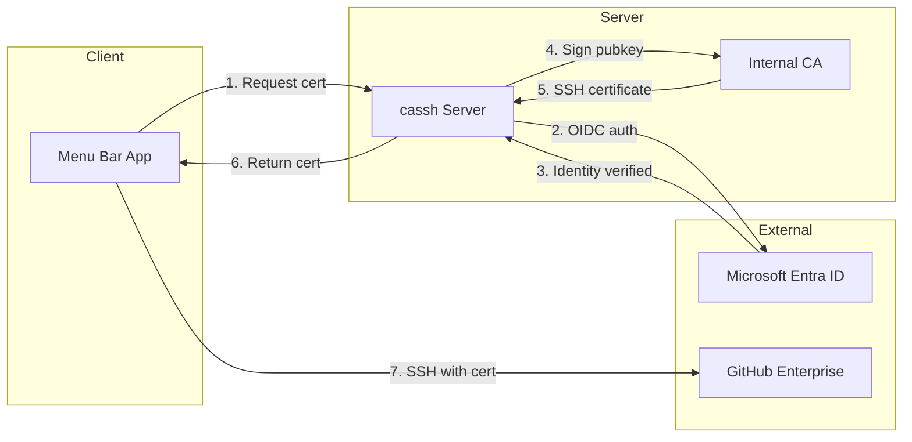
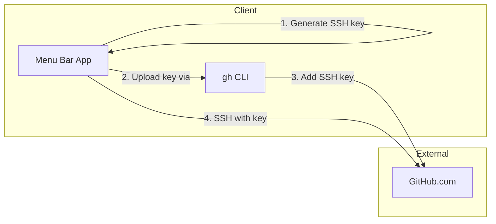

# cassh

<div align="center">
  

  <p><strong>SSH Key & Certificate Manager for GitHub</strong></p>
  <p><em>For individuals and enterprises alike</em></p>
</div>

Whether you're a solo developer managing personal projects or an enterprise team with hundreds of engineers, `cassh` brings security best practices to your SSH workflow — without the complexity.

---

## Get Started in 60 Seconds

**Personal GitHub.com users** — no server required:

```bash
# 1. Install GitHub CLI (if you haven't)
brew install gh
gh auth login

# 2. Install cassh
brew tap shawntz/cassh
brew install --cask cassh

# 3. Launch cassh — setup wizard opens automatically — done!
```

**Enterprise users** — see [Server Setup](server-setup.md) for CA and Entra configuration.


---

## Why cassh?

### For Individual Developers

You might think: *"I already use `gh` to upload my SSH key — why do I need this?"*

The `gh` CLI is great for the initial setup, but it doesn't manage your keys:

| The Problem | Without cassh | With cassh |
|-------------|---------------|------------|
| **Key lifecycle** | Keys live forever until you manually delete them | Automatic rotation (4 hours to 90 days) |
| **Laptop lost/stolen** | Your key still works until you notice and revoke it | Key auto-expires per your policy |
| **Shared/work computer** | That SSH key might still be there months later | Set short rotation for shared environments |
| **Multiple machines** | Different keys everywhere, no central management | Same workflow on every Mac |
| **SSH config** | Manually edit `~/.ssh/config` for each account | Automatic configuration |

> **Security isn't just for enterprises.** Your personal GitHub account has access to your private repos, your contributions to other projects, and possibly deploy keys. Treat it accordingly.

### For Enterprise Teams

Permanent SSH keys are a security liability:

| Scenario | With Permanent Keys | With cassh |
|----------|---------------------|------------|
| **Laptop lost** | Manual revocation required, often missed | Certificate expires automatically |
| **Employee offboarding** | Hunt down and revoke all their keys | Certificates expire within hours |
| **Compliance audit** | "When was this key last rotated?" | Full lifecycle tracking |
| **Key compromise** | Blast radius until detected | Limited to certificate validity window |

cassh issues **12-hour certificates** signed by your internal CA. No revocation lists to manage, no keys to track, no manual intervention needed.

---

## One App, All Your GitHub Accounts

Most developers juggle multiple GitHub accounts — work and personal, or multiple organizations. cassh manages them all from a single menu bar app.

- **Enterprise connections** use certificates that auto-expire
- **Personal connections** use keys with configurable rotation
- **Each connection** gets its own SSH key and config entry
- **Status at a glance** — green means you're good, yellow means expiring soon, red means action needed

---

## Features

| Feature | Personal | Enterprise |
|---------|:--------:|:----------:|
| One-click setup wizard | ✓ | ✓ |
| Automatic SSH config | ✓ | ✓ |
| Menu bar status indicator | ✓ | ✓ |
| Key/cert rotation | ✓ (configurable) | ✓ (12h default) |
| Multi-account support | ✓ | ✓ |
| Revoke & renew from menu bar | ✓ | ✓ |
| Microsoft Entra SSO | — | ✓ |
| CA-signed certificates | — | ✓ |
| MDM deployment (PKG) | — | ✓ |

---

## How It Works

### Personal Flow (GitHub.com)

```
Download cassh → Launch → Setup Wizard → Enter GitHub username → Done
```

Behind the scenes:
1. cassh generates an Ed25519 SSH key
2. Uploads it to GitHub via `gh ssh-key add`
3. Configures `~/.ssh/config` automatically
4. Tracks key age and rotates per your policy
5. On rotation: deletes old key from GitHub, generates new key, uploads new key

### Enterprise Flow (GitHub Enterprise)

```
Click menu bar → Generate Certificate → SSO login → Certificate installed
```

Behind the scenes:
1. Opens browser to your cassh server
2. Authenticates via Microsoft Entra ID
3. Server signs your public key with the CA
4. Certificate returned and installed automatically
5. Certificate expires in 12 hours — repeat as needed

## Architecture

### GitHub Enterprise Flow



### GitHub.com Personal Flow



## Quick Links

- [Getting Started](getting-started.md) - Prerequisites and initial setup
- [Server Setup](server-setup.md) - CA keys, Entra app, configuration (enterprise)
- [Deployment](deployment.md) - Fly.io, Render, Railway, VPS options (enterprise)
- [Client Distribution](client.md) - MDM deployment, PKG builds, Homebrew
- [Configuration Reference](configuration.md) - All config options explained
- [Roadmap](roadmap.md) - Planned features and development status
